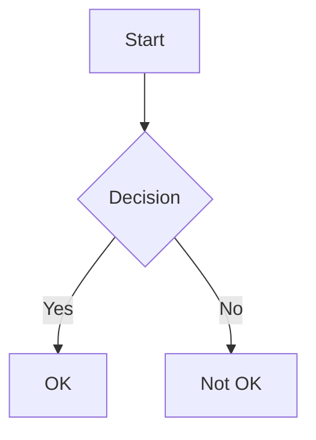
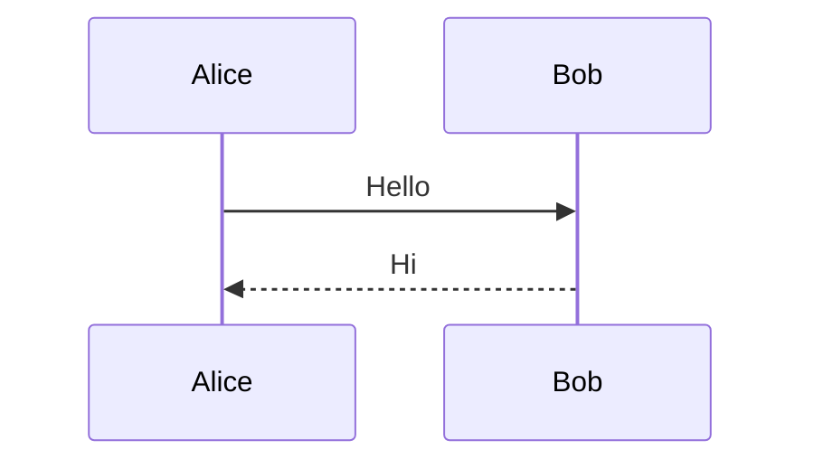

# Valid All Features

## Math

Inline: $x^2 + y^2 = z^2$

Display:

$$
\int_0^1 x^2 \, dx = \frac{1}{3}
$$

## Diagrams

## References

A [link to math](#math) section.

A [link to diagrams](#diagrams) section.
